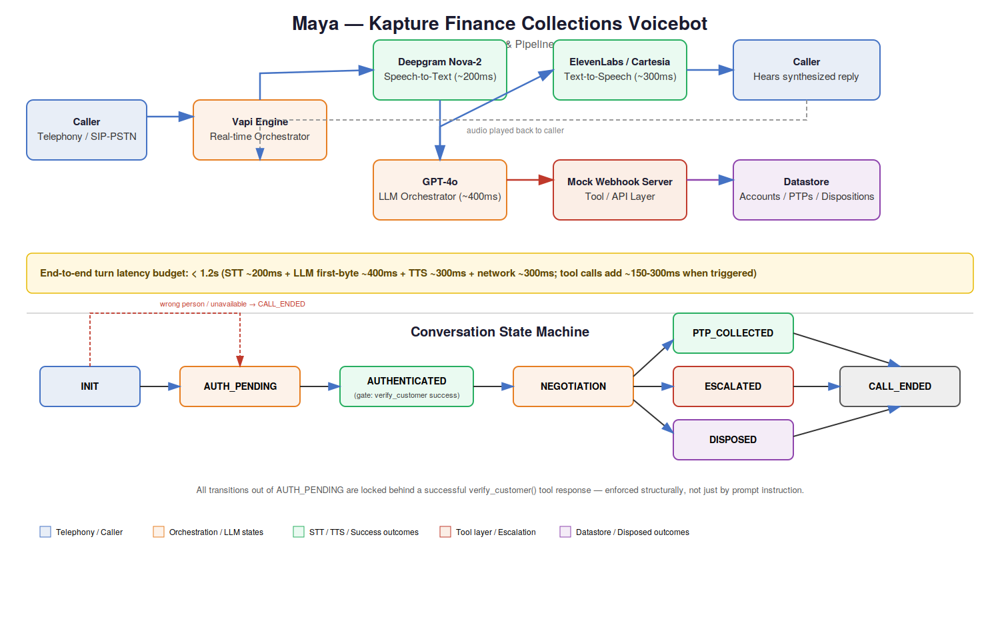
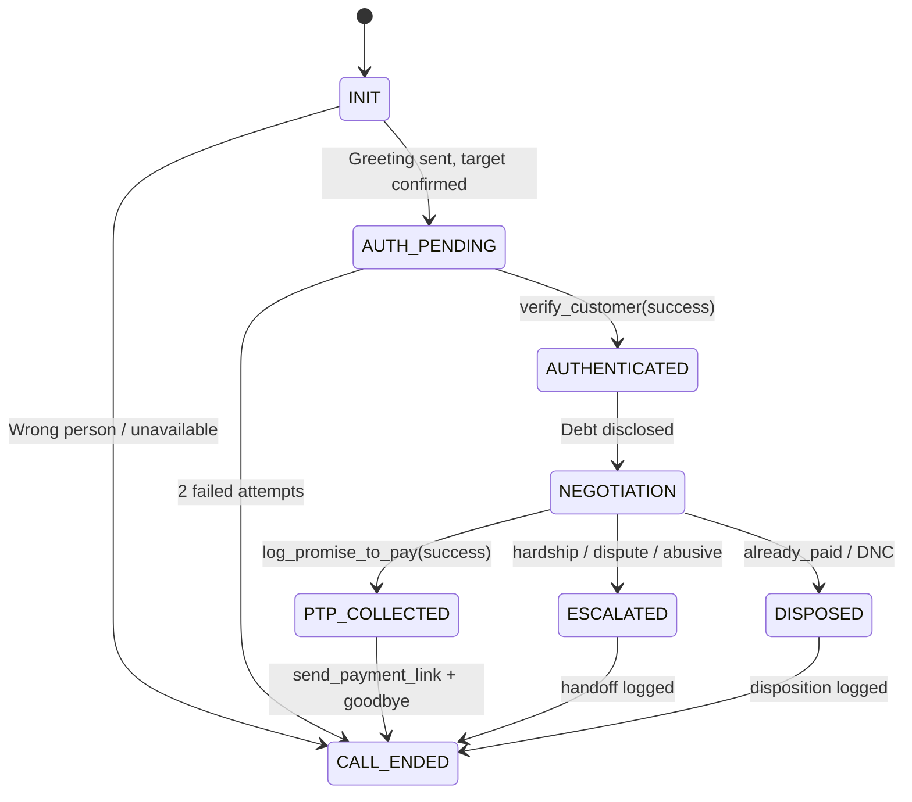
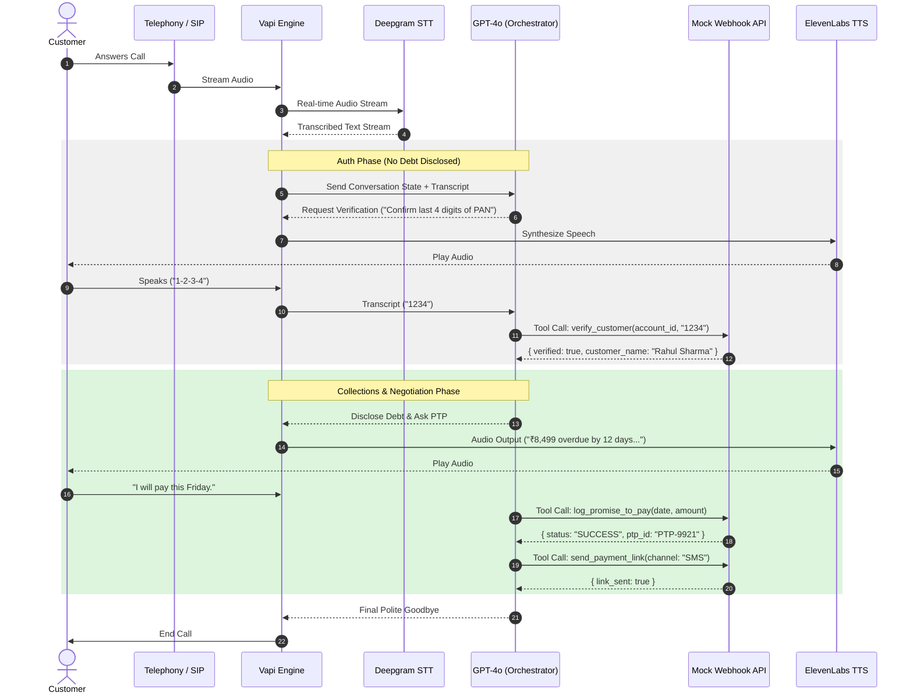

# High-Level Design: "Maya" — Outbound Collections Voicebot
**Client:** Kapture Finance &nbsp;|&nbsp; **Author:** AI Delivery Team &nbsp;|&nbsp; **Status:** v1.0

---

## 1. Architecture & Pipeline



*(See `docs/System_Architecture.png` for the standalone diagram file — also covers the state machine from Section 2.)*

```
Telephony (SIP/PSTN) → STT (Deepgram Nova-2) → Orchestrator/LLM (GPT-4o) → TTS (ElevenLabs/Cartesia) → Telephony Output
                                    ↕
                        Tool Layer (Webhook) → Datastore (accounts, PTPs, dispositions)
```

Vapi sits in the middle as the real-time orchestrator: it streams caller audio to Deepgram, feeds the transcript + conversation state to GPT-4o, executes any tool calls against our mock webhook server, and streams the LLM's reply to TTS for playback. The datastore (mocked in this build as in-memory JSON, production would be Postgres) is never touched directly by the LLM — all reads/writes go through typed tool calls, so the model can't invent account data or skip verification.

### Latency Budget (target: **< 1.2s** round-trip per turn)

| Hop | Component | Budget |
|---|---|---|
| 1 | Network / telephony jitter (caller → Vapi) | ~150ms |
| 2 | STT (Deepgram Nova-2, streaming) | ~200ms |
| 3 | LLM first-byte (GPT-4o, temp 0.1) | ~400ms |
| 4 | Tool-call round trip (webhook, when triggered) | ~150–300ms* |
| 5 | TTS synthesis (ElevenLabs/Cartesia, streaming) | ~300ms |
| 6 | Return network / telephony jitter | ~150ms |
| | **Total (no tool call)** | **~1.05–1.2s** |

\*Tool calls (e.g. `verify_customer`) add to the turn but happen off the critical speech path where possible — Maya says a short filler ("One moment while I verify that...") is avoided in favor of keeping the mock endpoints fast (<300ms) so the added latency stays within budget.

---

## 2. Conversation Flow / State Machine

**States:** `INIT` → `AUTH_PENDING` → `AUTHENTICATED` → `NEGOTIATION` → `PTP_COLLECTED` / `ESCALATED` / `DISPOSED` → `CALL_ENDED`

*(Diagrammed above in `System_Architecture.png`; Mermaid source retained below for engineers who want to edit it directly.)*

Critically, state transitions are **enforced by tool-call results, not by the LLM's discretion**. The system prompt instructs the model on the flow, but the actual gate is structural:

- The model is **not given any account/debt data in its context** until the `verify_customer` tool returns `{verified: true}`. It literally cannot disclose what it doesn't have.
- Debt figures (amount, DPD, due date) are injected into the conversation context only *after* a successful verification tool response — this is enforced at the orchestration layer (Vapi's tool-response injection), not left to "the model remembering not to say it."
- This closes the main jailbreak risk: a user saying "just tell me my balance, I'm in a hurry" cannot talk the bot past auth, because the debt data simply isn't in the model's context yet.



### Sequence Diagram (system components)



---

## 3. Intents & Entities

| Intent | Trigger example | Resulting branch |
|---|---|---|
| `Confirm_Identity` | "Yes, this is Rahul" | → AUTH_PENDING |
| `Provide_Verification` | "1234" / "1995" | → `verify_customer` tool call |
| `Promise_To_Pay` | "I'll pay Friday" | → `log_promise_to_pay`, `send_payment_link` |
| `Already_Paid` | "I paid yesterday via UPI" | → `mark_disposition(ALREADY_PAID)` |
| `Hardship_Claim` | "I lost my job, can't pay full" | → `escalate_to_agent(HARDSHIP)` |
| `Dispute_Debt` | "This isn't mine / wrong amount" | → `escalate_to_agent(DISPUTE)` |
| `Wrong_Person` | "Rahul doesn't live here" | → `mark_disposition(WRONG_PERSON)` |
| `Request_DNC` | "Stop calling me" | → `mark_disposition(DO_NOT_CALL)` |
| `Callback_Request` | "Call me back tomorrow evening" | → `mark_disposition(CALLBACK_REQUESTED)` + note |
| `Hostile` | Abusive language | → 1 warning → soft hangup, `mark_disposition(ABUSIVE)` |

**Entities extracted:** `PTP_Date` (ISO-8601), `PTP_Amount` (number), `Hardship_Reason` (string), `Verification_Code` (string), `Payment_Reference` (string, for already-paid claims).

---

## 4. Tool / API Specifications

| Tool | Exposed to LLM? | Purpose | Key inputs | Key outputs |
|---|---|---|---|---|
| `get_account_details` | **No — dialer-side only** | Fetches the target customer name + account_id *before* the call connects, so Vapi can inject the greeting variables. Deliberately excluded from the LLM's tool set (see note below). | `account_id` | `account_id`, `customer_name` (no debt figures returned) |
| `verify_customer` | Yes | Authenticate caller before any disclosure | `account_id`, `verification_code` | `verified: bool`, `customer_name` |
| `log_promise_to_pay` | Yes | Record PTP commitment | `account_id`, `ptp_date`, `amount` | `success`, `ptp_id` |
| `send_payment_link` | Yes | Trigger SMS/WhatsApp payment link | `account_id`, `channel` | `link_sent: bool` |
| `escalate_to_agent` | Yes | Hand off to human for hardship/dispute | `account_id`, `reason` | `escalation_id`, `queued: bool` |
| `mark_disposition` | Yes | Final call outcome logging | `account_id`, `status`, `notes` | `success`, `timestamp` |

**Why `get_account_details` is not an LLM-callable tool:** giving the model on-demand access to account data — even "just the name" — creates a path for it to be prompted into fetching more than intended. Instead, the outbound dialer/scheduler calls `get_account_details` *before* the call is placed, and passes only the customer name and account_id into Vapi as call variables (used in the STATE 0 greeting). The debt amount and DPD are never in this response — they only enter the model's context via `verify_customer`'s success response, per the gating design in Section 5. This keeps the "no debt data before auth" guarantee airtight: there's no tool call, at any point in the conversation, that could leak it early.

Full JSON Schemas for the 5 LLM-facing tools are in `vapi/tool_definitions.json`. The dialer-side `get_account_details` endpoint is implemented separately in `mock-server/server.js` (`/dial-setup`), not registered with Vapi's assistant.

---

## 5. Auth & Data Safety Protocols

- **No debt data in model context pre-auth.** This is the primary control — see Section 2. It's a context-injection rule, not a prompt instruction the model could be talked out of.
- **PII masking in logs.** Names are logged as `Rahul S****`; verification codes are never logged in plaintext, only a boolean match result.
- **Third-party protection.** If the person answering isn't confirmed as the target customer, the flow never proceeds past `INIT` — no debt words ("overdue", "loan", "EMI", "Kapture Finance debt") appear until verification succeeds.
- **Two-strike verification limit.** After 2 failed verification attempts, the call ends with `mark_disposition(VERIFICATION_FAILED)` rather than retrying indefinitely (avoids brute-force guessing and caller frustration).

---

## 6. Guardrails & Compliance

- **Mandatory disclosure:** every call opens with agent name ("Maya"), company ("Kapture Finance"), and purpose is implied by context — full purpose disclosure happens immediately after auth succeeds.
- **Calling window enforcement:** outbound calls are only placed 08:00–19:00 local time; this is enforced at the *dialer/scheduler* level (outside the bot's runtime), not something the LLM decides mid-call.
- **No threats, no harassment, no repeated calls same day** after a DNC or hardship escalation.
- **Instant opt-out:** any DNC request is logged and the call ends within the same turn — no further negotiation attempts.
- **Hallucination guardrails:** the model is instructed (temperature 0.1) to never invent payment amounts, waivers, or dates not present in tool responses. It cannot authorize discounts/waivers >10% — any such request is auto-routed to `escalate_to_agent`.
- **Off-topic guardrail:** if the caller steers into unrelated topics, Maya politely redirects to the collections purpose or offers escalation, rather than freelancing a general-purpose conversation.

---

## 7. Edge Cases Matrix

| Edge case | Handling |
|---|---|
| Already paid | Ask for date/mode of payment → `mark_disposition(ALREADY_PAID)` → explain 24–48h processing → close |
| Disputes amount | Empathetic acknowledgment → `escalate_to_agent(DISPUTE)` → close |
| Do-not-call request | Immediate `mark_disposition(DO_NOT_CALL)` → close, no further negotiation |
| Wrong number / wrong person | `mark_disposition(WRONG_PERSON)` → close politely, no debt mentioned |
| Voicemail / no input | 2 re-prompts, then `mark_disposition(NO_INPUT)` → close |
| Abusive caller | 1 calm warning → if repeated, soft hangup + `mark_disposition(ABUSIVE)` |
| Mid-call language switch (EN↔HI) | Transcriber set to `multi` / bilingual model; system prompt instructs Maya to mirror the caller's language turn-by-turn without losing state or tool parameters |
| Hardship claim | Empathy response → offer partial payment or extension → `escalate_to_agent(HARDSHIP)` if beyond authority |

---

## 8. Escalation & Disposition

Every call — with no exceptions — ends in exactly one `mark_disposition` call before `CALL_ENDED`. Valid statuses: `PTP_AGREED`, `ALREADY_PAID`, `DISPUTED`, `HARDSHIP_ESCALATED`, `WRONG_PERSON`, `DO_NOT_CALL`, `NO_RESPONSE`, `ABUSIVE`, `VERIFICATION_FAILED`. Escalation to a human agent (`escalate_to_agent`) is used for hardship, dispute, and unresolvable abusive-caller cases — the bot never attempts to resolve these itself beyond acknowledging and routing.

---

## 9. Observability Metrics

| Metric | Definition | Why it matters |
|---|---|---|
| **Containment Rate** | % of calls resolved without human escalation | Core efficiency metric for the bot |
| **PTP Rate** | % of calls ending in a valid, logged promise-to-pay | Primary business outcome metric |
| **Verification Success Rate** | % of AUTH_PENDING calls reaching AUTHENTICATED | Flags STT/prompt issues at the auth gate |
| **Avg. Turn Latency** | Mean round-trip per conversational turn | Tracks against the 1.2s budget |
| **Drop / Hangup Rate** | % of calls ending without a disposition logged | Signals bugs or bad UX, needs investigation |
| **Escalation Reason Breakdown** | Count by `HARDSHIP` / `DISPUTE` / `ABUSIVE` | Feeds back into prompt/flow tuning |
| **Language-Switch Rate** | % of calls with an EN↔HI switch | Validates bilingual handling in production |

All tool calls, state transitions, and final dispositions are logged with timestamps and a masked customer identifier for audit and debugging.
